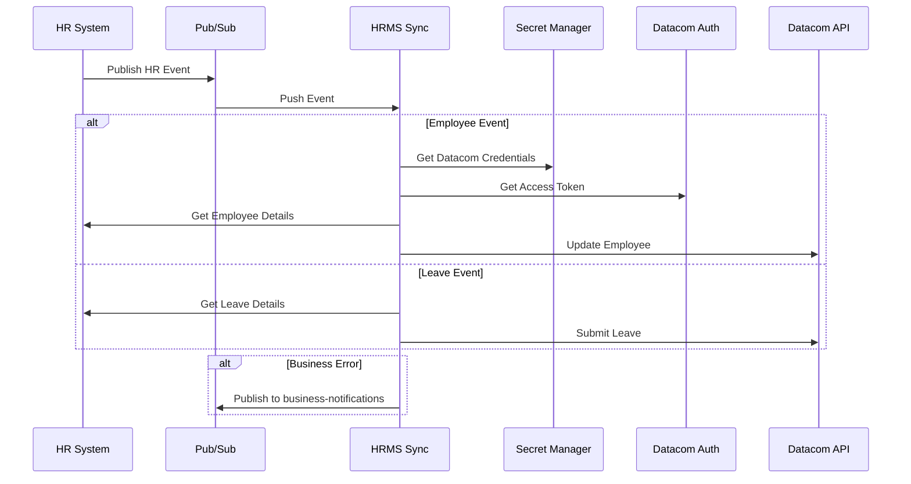

# HRMS Payroll Sync Service

A cloud-native microservice that synchronizes HR events (employee updates, leaves) to Datacom Payroll system.

## Overview

This service acts as an event-driven bridge between the HR system and Datacom Payroll, ensuring payroll data stays in sync with HR changes.

---

## Architecture



---

## Use Cases

1. **Employee Onboarding**
   - HR creates new employee
   - Service syncs employee to Datacom
   - Sets default payroll settings

2. **Employee Updates**
   - HR updates employee details
   - Service propagates changes to Datacom
   - Handles region-specific validations

3. **Employee Termination**
   - HR marks employee as terminated
   - Service updates end date in Datacom

4. **Leave Management**
   - HR records employee leave
   - Service submits leave to Datacom
   - Handles different leave types

---

## Cloud-Native Components

**Google Cloud Platform**
- **Cloud Run**: Hosts the stateless microservice
- **Pub/Sub**: Event messaging for HR events and business notifications
- **Secret Manager**: Secure storage for API credentials
- **Cloud Build**: CI/CD pipeline
- **Cloud Monitoring**: Observability and metrics

**Spring Cloud GCP**
- PubSub integration
- Secret Manager integration
- Tracing and monitoring

---

## Design Principles

1. **Event-Driven Architecture**
   - Asynchronous processing
   - Loose coupling with HR system
   - Business error notifications

2. **Cloud-Native Patterns**
   - Stateless design
   - Configuration externalization
   - Health checks and metrics
   - Graceful degradation

3. **Resilience Patterns**
   - Circuit breakers for external APIs
   - Retry mechanisms
   - Rate limiting
   - Error handling

---

## Configuration

### Profiles
- `local`: Local development with mock services
- `cloud`: Production deployment on GCP

### Feature Flags
- PubSub notifications
- Mock API responses
- Debug logging

---

## Prerequisites

- **Java Development Kit (JDK)**: JDK 11 or newer
- **Gradle**: Gradle 7.x or newer
- **Google Cloud SDK (gcloud)**: Latest version recommended
- **Docker**: Latest version recommended (if used for local testing or deployment)
- **(Optional) IDE**: IntelliJ IDEA or VS Code with relevant plugins

---

## Setup

1. **Initial GCP Setup**
   ```bash
   ./scripts/gcp-init.sh
   ```
2. **Post Deployment Setup**
   ```bash
   ./scripts/gcp-post-deploy.sh
   ```

3. **Verify & Test**
   ```bash
   # Test deployment
   ./scripts/gcp-verify-deployment.sh

   # Test APIs locally
   ./scripts/local-test-api.sh
   ```

4. **Local Development**
   ```bash
   export GOOGLE_APPLICATION_CREDENTIALS="key.json"
   ./gradlew bootRun
   ```

---

## API Documentation

OpenAPI documentation available at `/swagger-ui.html`

---

## Monitoring

- Health endpoint: `/actuator/health`
- Metrics: `/actuator/metrics`
- Prometheus: `/actuator/prometheus`

---

## Error Handling

1. **Technical Errors**
   - Retried automatically
   - Circuit breaker protection
   - Logged for debugging

2. **Business Errors**
   - Published to business-notifications topic
   - No retries
   - Logged for auditing 

---

## Contributing

We welcome contributions to improve and expand this service. Please follow these guidelines:

### Reporting Bugs
- Use GitHub Issues to report bugs.
- Provide detailed steps to reproduce the bug, including environment details and any relevant logs.

### Suggesting Enhancements
- Use GitHub Issues to suggest new features or enhancements.
- Clearly describe the proposed enhancement and its potential benefits.

### Pull Requests
1. Fork the repository.
2. Create a new branch for your changes (e.g., `feature/your-feature-name` or `bugfix/issue-number`).
3. Make your changes, ensuring code is well-formatted and includes relevant comments.
4. Add or update unit tests for your changes.
5. Ensure all tests pass locally.
6. Submit a pull request to the `main` branch.
7. Provide a clear description of your changes in the pull request.

---

## License

This project is licensed under the MIT License. See the [LICENSE.md](LICENSE.md) file for details.

*(Note: You may need to create a `LICENSE.md` file in the root of the repository if it doesn't exist yet.)*
